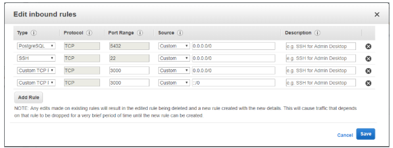

# 🚀 CI/CD Pipeline with Docker

A simple Next.js app deployed on AWS EC2 using Docker and GitHub Actions.

---

## 📋 Prerequisites

* AWS account
* GitHub account
* Docker&#x20;

---

## 🛠️ AWS EC2 Setup

1. **Launch EC2**: Choose Amazon Linux 2 or Ubuntu 20.04+, type `t2.micro`, default storage.

2. **Security Group**:

   | Type       | Port | Source    |
   | ---------- | ---- | --------- |
   | SSH        | 22   | 0.0.0.0/0 |
   | Custom TCP | 3000 | 0.0.0.0/0 |




   **Install Docker**:

   ```bash
   sudo yum update -y
   sudo amazon-linux-extras install docker -y
   sudo service docker start
   ```

3. **GitHub Runner**:

   * In GitHub: **Settings > Actions > Runners > New self-hosted runner** → Linux/x64 → copy steps.
   * On EC2:

     ```bash
     mkdir actions-runner && cd actions-runner
     curl -O -L https://github.com/actions/runner/releases/download/v2.x.x/actions-runner-linux-x64-2.x.x.tar.gz
     tar xzf actions-runner-linux-x64-2.x.x.tar.gz
     sudo ./svc.sh install
     sudo ./svc.sh start
     ```
   * Confirm **Idle** under **Actions > Runners**.

---

## 🐳 Dockerfile

```dockerfile
FROM node:20-alpine AS deps
WORKDIR /app
COPY package.json package-lock.json* ./
RUN npm install

FROM node:20-alpine AS builder
WORKDIR /app
COPY . .
COPY --from=deps /app/node_modules ./node_modules
RUN npm run build

FROM node:20-alpine AS runner
WORKDIR /app
ENV NODE_ENV=production
COPY --from=builder /app/.next ./.next
COPY --from=builder /app/public ./public
COPY --from=builder /app/node_modules ./node_modules
COPY --from=builder /app/package.json ./package.json
EXPOSE 3000
CMD ["npm", "start"]
```

---

## 🤖 GitHub Actions (`main.yml`)

```yaml
name: Deploy Next.js application
on:
  push:
    branches: [main]
jobs:
  build:
    runs-on: ubuntu-latest
    steps:
      - uses: actions/checkout@v4
      - name: Build & tag
        run: docker build -t ${{ secrets.DOCKERHUB_USERNAME }}/nextjs-app:latest .
      - name: Log in
        run: echo "${{ secrets.DOCKERHUB_PAT }}" | docker login --username "${{ secrets.DOCKERHUB_USERNAME }}" --password-stdin
      - name: Push
        run: docker push ${{ secrets.DOCKERHUB_USERNAME }}/nextjs-app:latest

  deploy:
    needs: build
    runs-on: self-hosted
    steps:
      - name: Pull & run
        run: |
          sudo docker pull ${{ secrets.DOCKERHUB_USERNAME }}/nextjs-app:latest
          sudo docker rm -f nextjs-app-container || true
          sudo docker run -d -p 3000:3000 --name nextjs-app-container ${{ secrets.DOCKERHUB_USERNAME }}/nextjs-app:latest
```

> **Secrets:** `DOCKERHUB_USERNAME`, `DOCKERHUB_PAT`

---

## 🚀 Deployment URL(Example)

[http://ec2-13-48-13-19.eu-north-1.compute.amazonaws.com:3000/](http://ec2-13-48-13-19.eu-north-1.compute.amazonaws.com:3000/)

---

## 📝 References

* Docker: [https://docs.docker.com](https://docs.docker.com)
* GitHub Actions: [https://docs.github.com/actions](https://docs.github.com/actions)
* AWS EC2: [https://docs.aws.amazon.com/ec2/](https://docs.aws.amazon.com/ec2/)
* My DockerFile: [https://github.com/therafiali/learn-ci-cd-pipeline-with-docker/blob/main/Dockerfile](https://github.com/therafiali/learn-ci-cd-pipeline-with-docker/blob/main/Dockerfile)
* My CICD pipeline code: [https://github.com/therafiali/learn-ci-cd-pipeline-with-docker/blob/main/.github/workflows/main.yml](https://github.com/therafiali/learn-ci-cd-pipeline-with-docker/blob/main/.github/workflows/main.yml)

